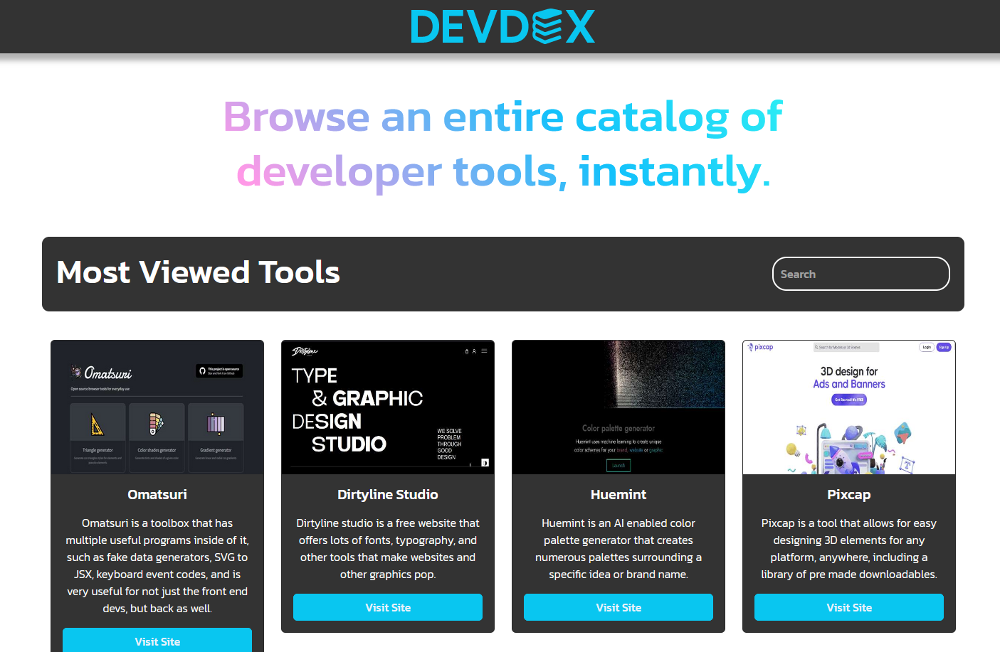

<!-- PROJECT LOGO -->
 

  

  <h2 align="center">DEVDEX</h2>

<!-- ABOUT THE PROJECT -->
## About Devdex
 

  

 
Remembering every single framework, IDE, developer tool, extension and so many more is a pain. I built Devdex with the intention to create one index to end them all. I hated having to go through journals and tech articles behind paywalls just to get to the free tool I wanted.
 
 
Why use Devdex?:

* It's fast. No bloating, no ads to bog down load times.
* I won't steal or sell your personal data, promise.
* It was built by a developer, for other developers.

(<a href="#readme-top">back to top</a>)

## Built on 

Devdex is almost fully custom made, front to back, full stack.

* ![Bootstrap][Bootstrap.com]
* ![Express][Express.js]
* ![Node][Node.js]
* ![PostgreSQL][Postgresql]
* ![Heroku][Heroku]

(<a href="#readme-top">back to top</a>)

<!-- Todo -->
## Things to do

- [x] Add search feature
- [x] Make it pretty
- [ ] Add more entries
- [ ] Add favorites feature

(<a href="#readme-top">back to top</a>)

<!-- LICENSE -->
## License

Distributed under the MIT License.

(<a href="#readme-top">back to top</a>)

<!-- CONTACT -->
## Contact

JP Noga - jpnogax@gmail.com - [![LinkedIn][linkedin-shield]][linkedin-url]

(<a href="#readme-top">back to top</a>)

<!-- MARKDOWN LINKS & IMAGES -->
<!-- https://www.markdownguide.org/basic-syntax/#reference-style-links -->

[linkedin-shield]: https://img.shields.io/badge/-LinkedIn-black.svg?style=for-the-badge&logo=linkedin&colorB=555
[linkedin-url]: https://www.linkedin.com/in/jp-noga/

[Bootstrap.com]: https://img.shields.io/badge/Bootstrap-563D7C?style=for-the-badge&logo=bootstrap&logoColor=white
[Express.js]: https://img.shields.io/badge/Express.js-404D59?style=for-the-badge
[Node.js]: https://img.shields.io/badge/Node.js-43853D?style=for-the-badge&logo=node.js&logoColor=white
[Postgresql]: https://img.shields.io/badge/PostgreSQL-316192?style=for-the-badge&logo=postgresql&logoColor=white
[Heroku]: https://img.shields.io/badge/Heroku-430098?style=for-the-badge&logo=heroku&logoColor=white

